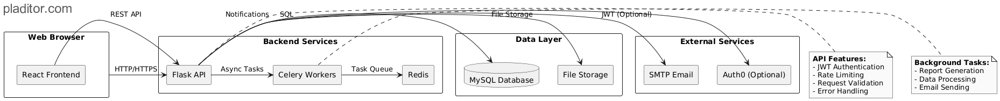

# 📊 Automated Analytics Report System



A comprehensive solution for transforming raw data into beautiful, interactive reports with AI-powered insights.

## ✨ Key Features

- **Smart Data Processing**

  - Automatic detection of data patterns and anomalies
  - Predictive trend forecasting
  - Natural language insights generation

- **Beautiful Visualizations**

  - Interactive charts and graphs
  - Correlation matrices
  - Customizable report templates

- **Enterprise Ready**
  - JWT authentication
  - Role-based access control
  - Email notifications
  - Scheduled report generation

## 🛠 Technology Stack

| Component        | Technologies                     |
| ---------------- | -------------------------------- |
| **Backend**      | Python, Flask, MySQL, SQLAlchemy |
| **Data Science** | Pandas, Scikit-learn, Plotly     |
| **Frontend**     | Next.js, React, Tailwind CSS     |
| **DevOps**       | GitHub Actions                   |

## 🚀 Getting Started

### Prerequisites

- Python 3.10+
- Node.js 18+
- MySQL 8.0+

## 🔒 Environment Variables

See [.env.example](.env.example) for required configuration.

## 🚨 Error Handling

The API returns standardized error codes:

| Code | Description           |
| ---- | --------------------- |
| 400  | Bad Request           |
| 401  | Unauthorized          |
| 404  | Not Found             |
| 500  | Internal Server Error |

### Installation

```bash
# Clone repository
git clone https://github.com/ranaromdhane/automated-reports.git
cd automated-reports

# Backend setup
cd backend
python -m venv venv
source venv/bin/activate  # Windows: venv\Scripts\activate
pip install -r requirements.txt

# Frontend setup
cd ../frontend
npm install
```
